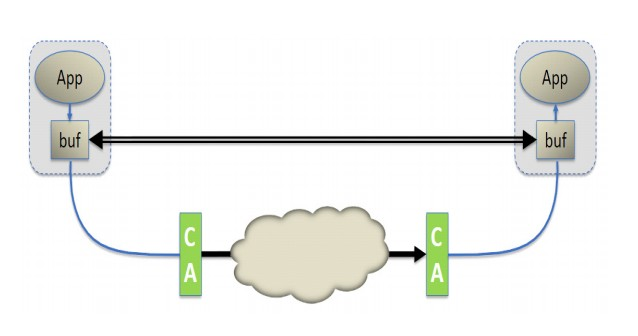

RDMA网络编程用户手册1.4版
======================

###术语表
<table>
<tr><th>术语</th><th>释义</th></tr>
<tr><td>Access Layer</td><td>操作系统底层构架，用来支持访问互联的集群(VPI,InfiniBand,Ethernet,FCoE).
它包括所有支持上层网络协议的基本传输服务、中间件和管理程序</td></tr>
<tr><td>AH(Address Handle)</td><td>在UD QP中，用来描述远程路径的对象</td></tr>
<tr><td>CA(Channel Adapter)</td><td>一个InfiniBand链路的终端设备，它执行传输层的功能</td></tr>
<tr><td>CI(Channel Interface)</td><td>通过网络适配器、相关固件和设备驱动的组合，呈现给Verbs
编程用户的通信管道</td></tr>
<tr><td>CM(Communication Manager)</td><td>负责建立、维持、释放RC和UC QP服务类型连接的体系;服务ID解析协议
确保了使用UD服务的用户找到支持指定设备的QP;每个终端节点的IB端口都有一个CM.</td></tr>
<tr><td>Compare & Swap</td><td>通知远程QP读取一个64bit的值，将这个值与提供的比较对象值作比较
，如果相等，那么就把读取的这个值替换成QP提供的另一个数值。</td></tr>
<tr><td>CQ(Completion Queue)</td><td>一个包含CQE的队列（先进选出）</td></tr>
<tr><td>CQE(Completion Queue Entry)</td><td>CQ中的一个记录，它描述了已完成的WR的信息
（状态，大小等）</td></tr>
<tr><td>DMA(Direct Memory Access)</td><td>允许硬件在不经CPU参与的情况下
将数据块移进和移出内存</td></tr>
<tr><td>Fetch & add</td><td>通知远程QP读取一个64bit的数值，将它替换为它和QP提供
的待加数的和。</td></tr>
<tr><td>GUID(Globally Unique IDentifier)</td><td>在一个子网中，唯一标志一个设备或组件的
64bit数字</td></tr>
<tr><td>GID(Global IDentifier)</td><td>一个128位的标志，用来标志网络适配器上的一个端口，
路由器上或者组播里的一个端口;为了更有效地寻找、通信和路由，IBA在标准IPV6地址的基础上定义了一些额外的
特性和约束，这就形成了GID。</td></tr>
<tr><td>GRH(Global Routing Header)</td><td>用来在子网间传递数据包和传递组播信息的包头。
包头基于IPv6协议</td></tr>
<tr><td>Network Adapter</td><td>允许网络中计算机之间传递数据的硬件。</td></tr>
<tr><td>Host</td><td>一台运行着操作系统，并且控制着一个或多个network adapter的计算机。</td></tr>
<tr><td>IB</td><td>InfiniBand</td></tr>
<tr><td> </td><td> </td></tr>
<tr><td>Join operation</td><td>一个IB端口要明确地加入一个多播组，必须向SA发送请求来接收
多播数据包。</td></tr>
<tr><td>lkey</td><td>在MR注册之后接收到的一个数字，它在本地被WR用来标志内存注册和
相关权限。</td></tr>
<tr><td>LID(Local IDentifier)</td><td>
子网管理程序指定给终端节点的一个16位地址。每个LID在它所在的子网中是唯一的。</td></tr>
<tr><td>LLE(Low Latency Ethernet)</td><td>
在CEE(Converged Enhanced Ethernet聚合加强型以太网)基础之上的RDMA服务。CEE允许IB在以太网上传输。</td></tr>
<tr><td>NA(Network Adapter)</td><td>
一个网络链接的终端设备，它执行传输层功能。</td></tr>
<tr><td>MGID(Multicast Group ID)</td><td>
MGID唯一标志一个IB多播组，它由SM管理。SM将每个MGID都关联一个MLID，并对网络中的IB交换机
进行编程控制，确保加入多播组的所有端口都能接收到数据包。</td></tr>
<tr><td>MR(Memory Region)</td><td>
已被注册为被允许使用的连续内存缓冲区。为了使网络适配器能利用它们，这些缓冲区需要先被
注册。在注册期间，一个L_Key和R_Key被创建出来用来关联相应的注册缓冲区。</td></tr>
<tr><td>MTU(Maximum Transfer Unit)</td><td>
端口收发数据包的最大有效负载的数据大小（不包括包头）限度。</td></tr>
<tr><td>MW(Memory Window)</td><td>
一个被分配的资源，在与已注册的内存中一块特定的区域绑定后，能被远程直接使用。每个MW都有一个
关联的窗口句柄、一些使用权限信息和当前的R_Key</td></tr>
<tr><td>Outstanding Work Request</td><td>
工作队列中没有被轮询到已完成的WR</td></tr>
<tr><td>pkey(Partition key)</td><td>
pkey标志了端口所属的分区。pkey大概类似于以太网中的VLAN ID。pkey用来指向端口的
pkey表中的一项。SM(subnet manager)将每个端口至少关联一个pkey</td></tr>
<tr><td>PD(Protection Domain)</td><td>
只有内部成员才能进行交互的域。AH与QP进行交互，MR与WQ进行交互。</td></tr>
<tr><td>QP(Queue Pair)</td><td>
为了在网络中节点之间传递数据，将独立的WQ打包在一起形成的一个配对
（发送队列和接收队列）。有三种类型的QP：UD 不可靠数据报，UC 不可靠连接，RC 
可靠连接。</td></tr>
<tr><td>RC(Reliable Connection)</td><td>
基于面向连连接的QP传输服务。一个QP与另一个QP相关联，两者之间的信息传输是可靠的
（具体体现在数据的正确性和顺序性）</td></tr>
<tr><td>RDMA(Remote Direct Memory Access)</td><td>
在不需远程计算机CPU的干预下，对它的内存进行操作。</td></tr>
<tr><td>RDMA_CM(Remote Direct Memory Access Communication Manager)</td><td>
用来建立可靠性连接和不可靠性数据报传输的API。它为建立连接提供了RDMA传输接口。
此API基于套接字，同时又适用于基于QP的语义：信息传递必须通过专门的RDMA设备，
并且数据传输是基于消息机制。</td></tr>
<tr><td>Requestor</td><td>
在一个连接中，发起数据传输的一端（通过发送一个请求）</td></tr>
<tr><td>Responder</td><td>
在一个连接中，回复发起者发送的请求命令的的一端。请求命令可能包括
对回复者内存进行读或写的请求，和要求回复者接收一条信息。</td></tr>
<tr><td>rkey</td><td>
在MR注册之后接收到的一个数字,对到来的RDMA操作进行许可认证。</td></tr>
<tr><td>RNR(Receiver Not Ready)</td><td>
在一个基于RC的QP中，两端的连接已经存在，但是RR目前不在接收端。</td></tr>
<tr><td>RQ(Receive Queue)</td><td>
一个用来存储用户发送的RR的工作队列。</td></tr>
<tr><td>RR(Receive Request)</td><td>
是一个会被发送到RQ中的WR。它描述了应该把到来的需要写的数据写在哪里。
需要注意的是，一个RDMA写操作会消耗一个RR。</td></tr>
<tr><td>RTR(Ready To Receive)</td><td>
一种QP的状态，它表示某个RR可以被发送和处理。</td></tr>
<tr><td>RTS(Ready To Send)</td><td>
一种QP的状态，它表示某个SR可以被发送和处理。</td></tr>
<tr><td>SA(Subnet Administrator)</td><td>
用来查询和操作子网管理数据的接口。</td></tr>
<tr><td>SGE(Scatter/Gather Elements)</td><td>
一个结构，指向本地已注册过的内存块的一部分或者整块。结构中的元素包含
内存块的起始地址、大小和lkey（和它相关的权限信息一起）。</td></tr>
<tr><td>S/G Array</td><td>
在WR里，存放S/G元素的元组。根据使用的操作命令，可以将不同缓冲区的数据收集起来，
并将这些数据当成一个单独的数据流进行发送，或者将一个单独的数据流切分成许多不同的
缓冲区。</td></tr>
<tr><td>SM(Subnet Manager)</td><td>
设置和管理子网的体系。它的功能包括：获知子网的网络拓扑结构，分配LID，
决定路由策略和设置路由表，一个主的SM或者还有一个从的SM（双机热备模式）,
初始化子网中交换机的路由表从而在子网中建立网络通路。</td></tr>
<tr><td>SQ(Send Queue)</td><td>
用来存储用户发送的SR的队列。</td></tr>
<tr><td>SR(Send Request)</td><td>
是一个会被发送到SQ中的WR，描述了需要传输的数据有多大、数据的目标位置以及传输的方式
（具体的操作码会确定传输方式）。</td></tr>
<tr><td>SRQ(Share Receive Queue)</td><td>
是一个保存着接收到的信息的WQE队列，接收到的信息可以来自于任何相关的RC/UC/UD QP.
多个QP可与同一个SRQ关联。</td></tr>
<tr><td>TCA(Target Channel Adapter)</td><td>
一个不需要支持verb语法的通道适配器，通常用在I/O设备中。</td></tr>
<tr><td>UC(Unreliable Connection)</td><td>
基于面向连接的QP传输服务，一个QP和另一个QP相联系。QP们没有执行可靠协议，传输过程中
信息可能丢失。</td></tr>
<tr><td>UD(Unreliable Connection)</td><td>
一种QP传输服务，消息的以包为单位。每个UD QP能和子网中其它的UD QP进行数据的接收和发送。
消息在传递的过程中可能会丢失并且到达顺序可能会混乱。UD QP是唯一支持多播消息的模式。
UD数据包的大小受限于MTU</td></tr>
<tr><td>Verbs</td><td>
网络适配器的功能的一种抽象描述。使用Verbs,任何应用都能创建和管理用于RDMA数据传输的
对象。</td></tr>
<tr><td>VPI(Virtual Protocol Interface)</td><td>
允许用户能够改变端口的2层协议。</td></tr>
<tr><td>WQ(Work Queue)</td><td>
SQ或RQ中的一种。</td></tr>
<tr><td>WQE(Work Queue Element)</td><td>
读音为"wookie"，是WQ（工作队列）中的一个元素。</td></tr>
<tr><td>WR(Work Request)</td><td>
用户提交至WQ（工作队列）的一个请求。</td></tr>
</table>

###1 RDMA体系结构概述
####1.1 InfiniBand
InfiniBand(IB)是一种服务器和存储器的互联技术，它具有高速、低延迟、低CPU负载、
高效率和可扩展的特性。InfiniBand的关键特性之一是它天然地支持远程直接内存访问（RDMA）
。InfiniBand能够让服务器和服务器之间、服务器和存储设备之间的数据传输不需要主机的CPU
的参与。InfiniBand使用I/O通道进行数据传输，每个I/O通道提供虚拟的NIC或HCA语义。InfiniBand
提供了多种技术方案，每个端口的速度从10Gb/s(SDR)至56Gb/s(FDR)，使用铜轴电缆和光纤进行
连接。InfiniBand的高效率和可扩展性使它在很多领域成为最佳的性能和性价比的服务器内联方案，
这些领域包括：高性能计算、云计算、Web2.0应用、存储、数据库、金融数据中心和应用。InfiniBand
是IBTA组织制定的技术标准。

####1.2 虚拟协议互联（VPI）
Mellanox的VPI架构为同时支持IB和Ethernet的网络提供了高性能、低延迟和高可靠性的保障。
VPI的作用体现在适配器和交换机这些设备之间的数据传输。一个VPI适配器可以在每个单品设置为
使用IB语义或者Ethernet语义的传输方式。例如，一个双端口的VPI适配器可以进行如下设置： 
*	一个适配器（HCA）配置两个IB端口;
*	一个网卡（NIC）配置两个Ethernet端口;
*	一个适配器同时配置一个IB端口和一个Ethernet端口。

类似地，一个VPI交换机可以配置为仅有IB的端口、仅有Ethernet的端口或者有IB端口和Ethernet
端口同时工作。 
Mellanox支持的VPI适配器和交换机既支持IB的RDMA也支持Ethernet的RoCE方案。

####1.3 基于聚合以太网的RDMA
RoCE是基于以太网（Ethernet）的RDMA的技术标准，它也是由IBTA组织制定的。RoCE为以太网
提供了RDMA语义，并且不需要复杂低效的TCP传输（例如，iWARP则需要）。

RoCE是现在最有效的以太网低延迟方案。它消耗很少的CPU负载，它在数据中心桥接以太网中利用
优先流控制来达到网络的无损连通。自从OFED1.5.1版本开始，Open Fabrics Software就已经对
RoCE有很好的支持。

####1.4 不同RDMA技术的比较
目前，有三种支持RDMA的技术：IB、以太网RoCE、以太网iWARP。这三种技术使用本文中定义的同
一API，但它们有着不同的物理层和链路层。

在以太网解决方案中，RoCE相对于iWARP来说有着明显的优势，这些优势体现在延时、吞吐率和
CPU负载。RoCE被很多主流的方案所支持，并且被包含在Windows服务软件中（IB也是）。

RDMA技术基于传统网络的概念，但与IP网络又有些不同。最关键的不同是RDMA提供了一种消息服务，
利用这种服务，应用程序可以直接访问远程计算机上的虚拟内存。消息服务可以用来进行网络中进程
的通信（IPC）、与远程服务器进行通信和在一些上层协议的协助下与存储设备进行数据传递。上层
协议（ULPs）有很多，例如：iSCSI的RDMA扩展（iSER）、SCSI RDMA协议（SRP）、SMB、Samba
、Lustre、ZFS等等。

RDMA利用旁路和零拷贝技术提供了低延迟的特性，同时，减少了CPU占用，减少了内存带宽瓶颈，
提供了很高的带宽利用率。RDMA所带来的关键好处得益于RDMA消息服务呈现给应用的方式，和底层用来
发送和传递这些消息的技术。RDMA提供了基于IO的通道。这种通道允许一个应用程序通过RDMA设备对
远程的虚拟内存进行直接的读写。

在传统的套接字网络中，应用程序要向操作系统申请使用网络资源时，要通过特定的API来管理程序的
相关行为。但是，RDMA使用操作系统仅仅建设一个通道，然后就可以在不需要操作系统的干预下，应用
程序之前就能够进行直接的消息传递。消息可以是RDMA读或写操作，也可以是发送/接收操作。IB和
RoCE也都支持多播模式。

IB在链路层提供的特性有：基于信任的流控制机制用来进行拥塞控制。它也支持使用虚拟局域网（VLs），
虚拟局域网能够使高层协议简单化，并且提供高质量服务。IB在VL中严格保证数据在一条路径中能够
按序到达。IB的传输层提供可靠性和交付性保障。

IB网络层拥有的特性使它能够很简单地在应用程序的虚拟内存之间传递消息，尽管应用参与通信
的应用程序运行在不同的物理服务器上。因此，将IB传输层和软件传输接口组合起来，可以看成是一
种RDMA消息传输服务。包括软件传输接口的整个协议栈，包含了IB消息服务。

最重要的一点是，每个应用程序都能直接访问集群中的设备的虚拟内存。这意味着，应用程序
传输消息时不需要向操作系统发出请求。与传统的网络环境相比，传统网络中共享的网络资源
归操作所有，不能由用户态程序直接使用，所以，一个应用程序必须在操作系统的干预下将数据
从应用程序的虚拟内存通过网络栈传送到网线上。类似地，在另一端，应用程序必须依靠操作
系统获取网线上的数据，并将数据放到虚拟缓冲区中。

TCP/IP/Ethernet是一种子面向字节流的传输方式 ，信息以字节的形式在套接字应用程序之间
传递。TCP/IP本身是不可靠的（传输过程中数据可能丢失或者失序），但是它利用传输控制协议
（TCP）来实现可靠性机制。TCP/IP在所有操作中都需要操作系统的干预，包括网络两终端结点
的缓冲区拷贝。在面向字节流的网络中，没有消息的边界概念。当一个应用想要发送一个数据包，
操作系统把这些字节数据放入内存中属于操作系统的一个匿名缓冲区，当数据传输完毕时，操作
系统把它缓冲区中的数据拷贝到应用程序的接收缓冲区。这个过程在每个包到达时都会重复执行，
直到整个字节流被接收到。TCP负责将任何因拥塞导致的丢包进行重发。

在IB中，一个完整的消息被直接发送到一个应用程序。一旦一个应用程序请求了RDMA的读或写传输，
IB的硬件将需要传输的数据按照需要分割成一些数据包，这些数据包的大小取决于网络路径的最大
传输单元。这些数据包通过IB网络，被直接发送到接收程序的虚拟内存中，并在其中被组合为一个
完整的消息。当整个消息都到达时，接收程序会接收到提示。这样，发送程序和接收程序在直到整
个消息被发送到达接收程序的缓冲区之前都不会被打扰中断。

####1.5 主要构件

#####Host Channel Adapter
HCA为一个IB终端节点（例如一个服务器）连接到IB网络中提供了连接点。这类似于以太网卡（NIC）
，但比NIC做更多的事情。HCA在操作系统的控制下提供了地址翻译机制，允许应用程序直接使用
HCA。相同地利用这种地址翻译机制，HCA能够在用户态程序下对内存进行使用。应用程序直接使用
虚拟地址进行操作，HCA能将这些虚拟地址翻译为物理地址，这样就实现了消息的有效传输。

#####Range Extenders
